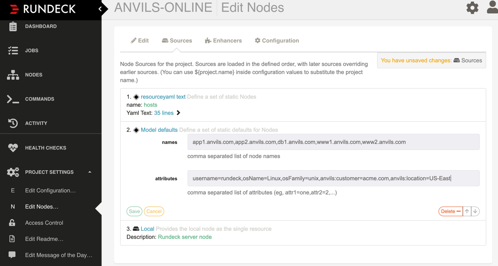

# Adding attributes to nodes

The Model defaults plugin allows you to `add` a static set of attributes to nodes by exactly matching nodenames.


NOTE: When defining a tag it is added to the existing tags. For all other attributes, the last definition processed is the one that is set. For example, if the first node source is a resourceyaml file and the second is the model defaults, and both set the attribute osFamily, the value from the model default is used.

For example, an automated system brings in the following node resource model which lacks `osFamily`,`osName`, `username` and some custom attributes. The definitions define minimal parameters that cannot be matched by the node enhancer. The basic definition is shown below:
```
app1.anvils.com:
 hostname: linux-1:2222
 "anvils:server-pool": app
 "anvils:server-pool-id": 1
 "anvils:server-dir": /tmp/anvils/app1
 tags: app
app2.anvils.com:
 hostname: linux-2:2223
 "anvils:server-pool": app
 "anvils:server-pool-id": 2
 "anvils:server-dir": /tmp/anvils/app2
 tags: app
db1.anvils.com:
 hostname: linux-1:2222
 "anvils:server-pool": db
 "anvils:server-pool-id": 1
 "anvils:database-owner": anvilsdb
 tags: db
www1.anvils.com:
 name: www1.acme.com
 hostname: linux-1:2222
 "anvils:server-pool": www
 "anvils:server-pool-id": 1
 "anvils:server-dir": /tmp/anvils/www1
 tags: www
www2.anvils.com:
 name: www2.acme.com
 hostname: linux-2:2223
 "anvils:server-pool": www
 "anvils:server-pool-id": 2
 "anvils:server-dir": /tmp/anvils/www2
 tags: www

```

## Install the plugin
Use the plugin manager to download the supported plugin directly from Rundeck.
1. Click the gear icon.
2. Select Plugin and then choose Find Plugins.
3. Enter `Model Defaults` and click the search icon.
4. Under the official repository, click `Install` on the Model Defaults item.

## Enable the resource model
From the Project list select the project where you want to use the model default node resource.
Go to Project Settings and select Edit Nodes.
On the Sources tab select `Add a new node source`.
In names, enter a comma separated list of nodenames.
In attributes, enter a comma seprated list of attributes to add to each matched node. Format the definition as `attribute_name`=`value` or to group attributes use `group_name`:`attribute_name`=`value`.
The example shows how to add attributes to the nodes defined above.

